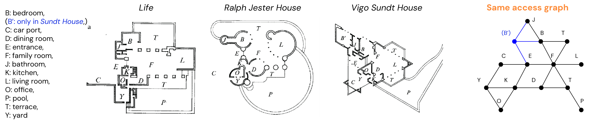

<h1 id="about-me"></h1>

<h2 style="margin: 80px 0px 10px;"></h2>

I am a PhD researcher in the faculty of Architecture and the Built Environment at TU Delft.
I am part of the AiDAPT lab, Design Data and Society Group, and Computer vision lab.

Broadly speaking, I guess that I am most interested in and intrigued by <strong>machine learning on graphs and geometries</strong>.
The field I am working in and applying this to lies at the intersection of machine learning (ML), computer vision (CV), graph theory & ML, and architectural design & data representation.
My focus is on floor plan machine understanding and how to develop <strong>ML models that learn useful internal representations of floor plan data</strong>, in short: <strong>floor plan representation learning</strong>.

<!--
Often in talks, lectures, and discussions, I give the following example of a core capability I would like to see back some day in computer models we have developed.

-->

On the side, yet influencing my research and teaching, I like to think about what "architectural intelligence" means and why understanding what it means matters (you follow?).
Academically, the things that I like to do most are talking to other researchers, teaching, writing and making figures.
Yes indeed, making figures: one of the most important things in science. 
With writing I mean: writing words, sentences, paragraphs, and papers; but also: code.

As always, best for last. 
I love the people that I work with, and I am very grateful for the vibrant and caring atmosphere we have set up over the years in the lab and groups that I work in.
There is simply nothing more important at work (and, let's be honest: in life) than the people around you.

<!--  -->

<h2 style="margin: 60px 0px 10px;">Contact</h2>

Interested to talk or collaborate? Please send me an email at c \[dot\] c \[dot\] j \[dot\] vanengelenburg \[at\] tudelft \[dot\] nl.
Or simply message me on [LinkedIn](https://www.linkedin.com/in/casper-van-engelenburg-12833213b/).
